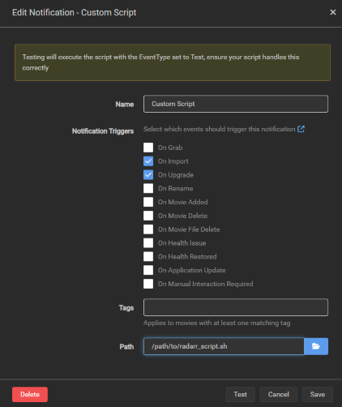

# letterboxd2plex
I use [Letterboxd](https://letterboxd.com/) as my movie watched log.

This python script lets you sync your Letterboxd ratings to your Plex server (one-way only)


## Usefulness
This script could be useful for:

- Making delete rules based on the more poorly rated movies using [Maintainerr](https://github.com/jorenn92/Maintainerr/tree/main)
- Using [Plex Meta  Manager](https://metamanager.wiki/en/latest/) for creating poster overlays containing your movie ratings


## Usage
Simply run the script with python passing your config file as argument:
```bash
python3 letterboxd2plex.py --config config.yml
```

The script can be run periodically with cron. Here's an example running every 2 hours:
```
0 */2 * * *    /usr/bin/python3 /path_to_script/letterboxd2plex.py --exit_on_match > /dev/null 2>&1
```

The `--exit_on_match` flag stops the sync on the first rating match found. This is useful if you are running the script periodically, for decreasing the script run time.

You can more find information about the command arguments by running `python3 letterboxd2plex.py -h`

### Radarr configuration
You can also trigger the script **only when importing a movie**, using with [Radarr Custom Scripts](https://wiki.servarr.com/radarr/settings#connections). 
You should set a *Custom Script* as shown below:




## Dependencies
This script requires the following python packages to be installed:

- plexapi
- feedparser

You can install them by running `python3 -m pip install plexapi feedparser`


## Configuration File
The script requires a YAML configuration containing:

- Your Letterboxd RSS feed url
- Your Plex server URL
- Your Plex device token. You can find more info on how to get it [here](https://support.plex.tv/articles/204059436-finding-an-authentication-token-x-plex-token/)
- Your Plex library name to sync

You can find an exaple configuration on *sample_config.yml*

---
---

# Other
If you are using this kind of script, it's likely that you are really into the Homelab thing. I also made a few custom scripts for missing functionalities like:

## maintainerr4telegram
If you use [Maintainerr](https://github.com/jorenn92/Maintainerr) for automatically deleting movies based on custom filters, this script could be useful. 

Basically this script monitors selected Plex Collections and **sends a Telegram notification** when a new movie is added to them. You can set it to monitor Maintainerr filtered collections, and it will notify you when a movie triggered the filter. 

Currently this functionality is missing from Maintainerr. I've added a [feature request](https://github.com/jorenn92/Maintainerr/issues/914) for this, but in the meantime this will do the trick.

### Usage
Simply run the script with python passing your config file as argument:
```bash
python3 maintainerr4telegram.py --config config.yml
```

### Dependencies
This script requires the following python packages to be installed:

- plexapi
- telebot

You can install them by running `python3 -m pip install plexapi telebot`
